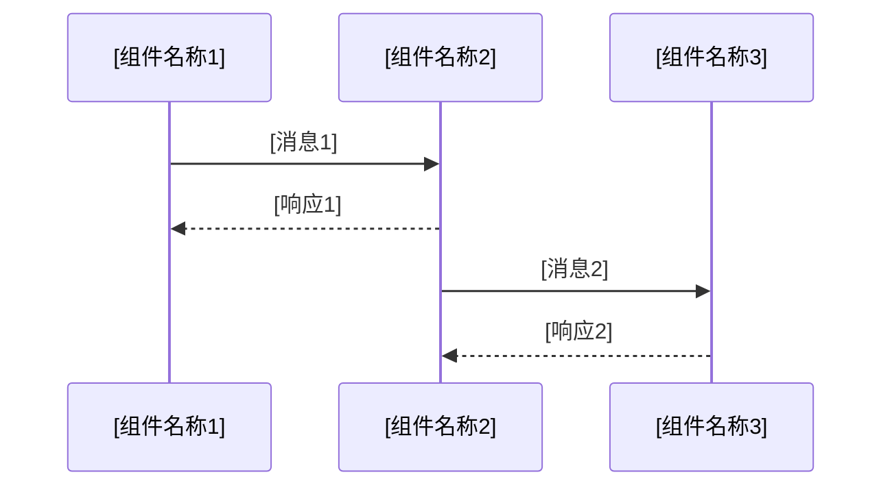
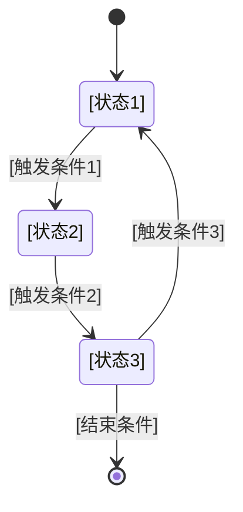

# Design 增量模板

> delta-design.md 模板，基于 specs/design.md 的增量变更
> 适用于系统底层服务设计（驱动/hiview插件/系统服务）
> AI理解提示词：时序图采用Mermaid格式，状态机采用Mermaid格式，接口设计和AR描述采用表格格式

## 1. 基本信息

### 1.1 版本信息
- 产品版本: [版本号]
- 文档版本说明: [版本变更说明]

### 1.2 功能信息
- 功能编码、名称
- 输入、处理、输出

---

## 2. SR 设计

### 2.1 基本信息

| SR编号 | SR名称 | SR描述 | IR编号 | IR名称 | IR描述 |
| ------ | ------ | ------ | ------ | ------ | ------ |
|        |        |        |        |        |        |

### 2.2 设计思路
[SR整体设计思路描述。当存在多个设计用例时，此处描述设计用例之间的关系。]

### 2.3 设计用例

#### 2.3.1 设计用例1: [设计用例编码] [设计用例名称]

##### 2.3.1.1 用例描述
[用例的详细描述，包括场景、前置条件、后置条件等]

##### 2.3.1.2 时序图【可选】



[时序图的文字说明]

| 消息名称 | 实现接口名称 | 说明 |
| -------- | ------------ | ---- |
|          |              |      |

##### 2.3.1.3 状态机【可选】



[状态机的文字说明]

##### 2.3.1.4 可靠性分析（功能FMEA分析）【可选】

改进措施实现设计：
[采用富文本或其他方式补充描述改进措施实现设计的细节，包括设计思路、实现设计、时序图、状态机等，实现AR分解]

| AR名称 | 对应系统元素 | 属性 | 关联改进措施 |
| ------ | ------------ | ---- | ------------ |
|        |              |      |              |

##### 2.3.1.5 安全分析【可选】

| 系统需求编号 | 系统需求 | SDR/SPEI功能规范编号 | SPEI实例描述 |
| ------------ | -------- | -------------------- | ------------ |
|              |          |                      |              |

安全实现设计：

| AR名称 | 对应系统元素 | 属性 | 关联改进措施 |
| ------ | ------------ | ---- | ------------ |
|        |              |      |              |

##### 2.3.1.6 其他描述【可选】
[采用富文本或其他方式补充描述用例的细节]

#### 2.3.2 设计用例2: [设计用例编码] [设计用例名称]

##### 2.3.2.1 用例描述
##### 2.3.2.2 时序图【可选】
##### 2.3.2.3 状态机【可选】
##### 2.3.2.4 可靠性分析【可选】
##### 2.3.2.5 安全分析【可选】
##### 2.3.2.6 其他描述【可选】

---

## 3. 组件/服务/模块设计信息

### 3.1 架构变化

> 描述版本中系统元素（组件/服务/模块及其逻辑接口）的新增/修改等变更

变更原因：[描述触发本次架构变更的业务或技术背景]
功能职责变化：[按需补充变化概述]

| 变更类型 | 系统元素类型 | 系统元素名称 | 变更描述 |
| -------- | ------------ | ------------ | -------- |
|          |              |              |          |

开发模型变化：[代码路径、目标二进制、交付包相对之前版本的变化点]
部署模型变化：[和节点的部署关系的变化点]
运行模型变化：[和进程/线程等并发运行资源的关系的变化点]
质量属性变化：[此系统元素的质量属性要求的变化点]

### 3.2 接口设计

| 接口名称 | 接口类型 | 所属系统元素 | 接口定义 | 用例ID | 关联AR ID |
| -------- | -------- | ------------ | -------- | ------ | --------- |
|          |          |              |          |        |           |

### 3.3 AR 描述

#### 3.3.1 AR-1描述

| AR名称 | 对应系统元素 | 属性 | 关联SR |
| ------ | ------------ | ---- | ------ |
|        |              |      |        |

- **AR规格**

  - AR规格编号：
    - AR规格属性：[包括业务、安全、性能、可靠性、可用等属性]
    - AR规格描述：[具体规格的描述，包括指标、能力，对系统元素的要求等]
    - 关联的功能规格编号：[可选，与功能规格的关联]

- **AR描述**

  - 简述：[角色、做什么事、结果]
  - 输入：[数据格式、数据来源]
  - 处理：[正常流程、异常流]
  - 输出：[数据格式、数据目的地]

#### 3.3.2 AR-2描述

---

## 4. 代码目录与文件规划

```
[模块路径/]
├── 文件1.c/.cpp    # AR-XXX 功能描述
├── 文件2.h         # 头文件/接口定义
├── Kconfig
├── Makefile
└── ...
```

---

## 5. AR ↔ SR ↔ UC 追溯

| AR | 实现 SR | 关联 UC | AR-Tier |
| --- | ------- | ------- | ------- |
|     |         |         |         |

---

## 6. SR 验收门禁

### 6.1 验收门禁矩阵

| SR | SR 验收标准(摘要) | 门禁 AR |
| --- | ---------------- | ------- |
|     |                  |         |

### 6.2 门禁与里程碑对齐
- M1：AR-T0~T3 完成 → 可验收 SR-00、SR-03、SR-05
- M2：AR-T4~T5 完成 → 可验收 SR-01、SR-02、SR-04(内核侧)
- M3：AR-T6~T7 完成 → 可验收 SR-04 全量、SR-06、SR-07
- M4：AR-T8+叶子完成 → 可验收 SR-08、SR-09、SR-10

---

## 7. 开发顺序建议（里程碑）

1. **M1 内核底座**：AR-K8(T0) → AR-K1(T1) → AR-K2(T2) → AR-K6(T3) → AR-K3/K5(T4)
2. **M2 内存与事件**：AR-K4(T4) → AR-K7(T5) → AR-U2/U3(T6)
3. **M3 用户态闭环**：AR-U1(T2) → AR-U2(T6) → AR-U3(T6) → AR-U4/U5(T7)
4. **M4 配置/安全/自保护**：AR-U6/U7(T3) → AR-X1/X3(T1/T2) → AR-X2/X4(T8)

---

## 8. 附录

### 8.1 术语表

| 术语 | 英文 | 定义 |
| ---- | ---- | ---- |
| SR | System Requirement | 系统需求 |
| AR | Allocated Requirement | 分配需求 |
| UC | Use Case | 用例 |
| SR-Tier | SR依赖等级 | SR模块的依赖层级 |
| AR-Tier | AR依赖等级 | AR单元的依赖层级（T0最底层） |

---

> 本文档由 mod-design skill 生成。
> 生成时间: {当前时间}
